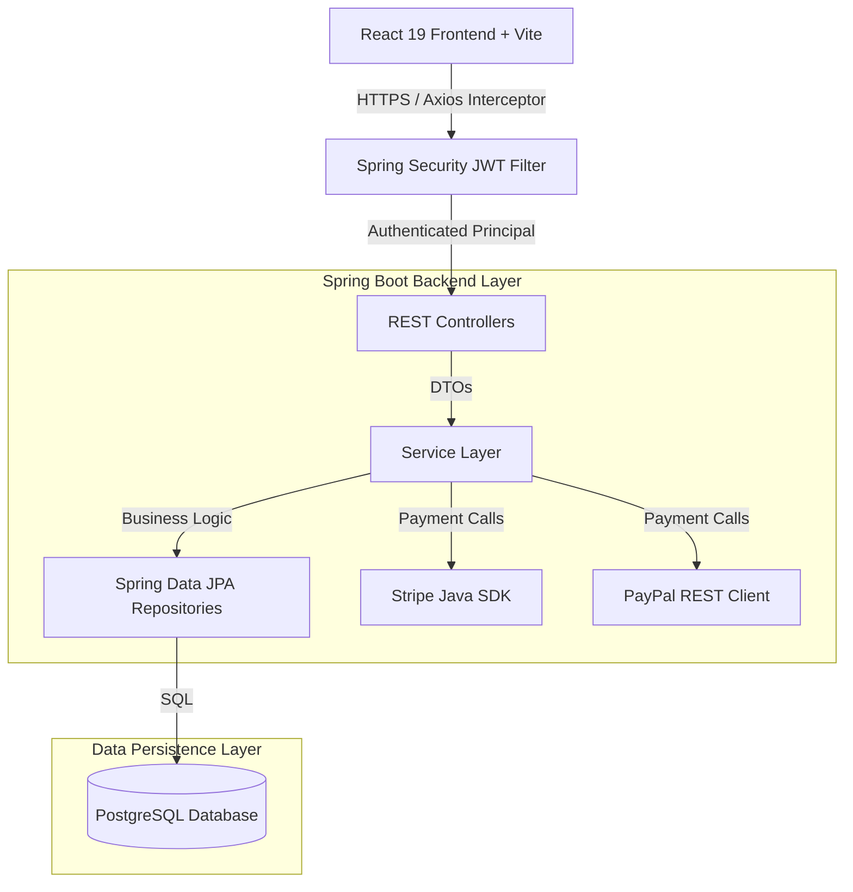
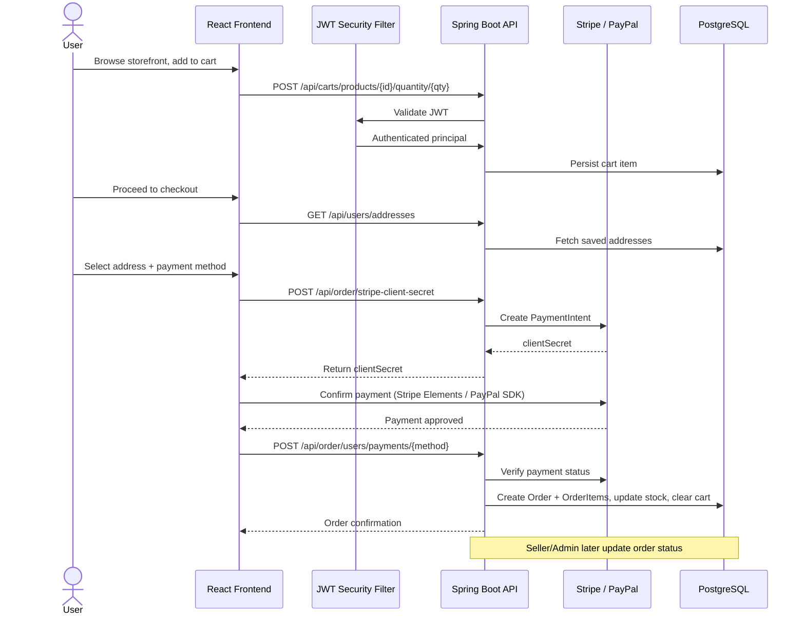
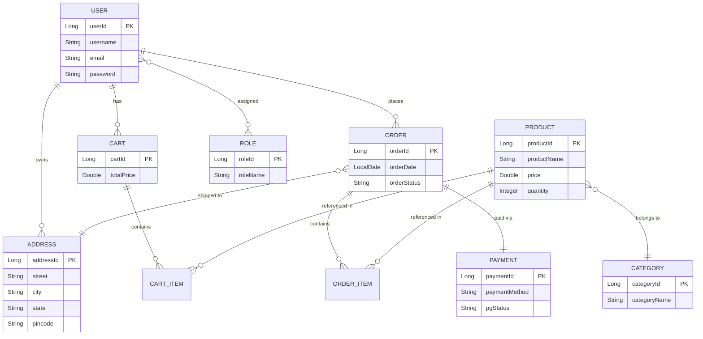

<div align="center">

# 🛍️ ShopVerse

### Premium Full-Stack E-Commerce Platform

**Spring Boot REST API** × **React 19 + Redux Toolkit**

[](https://openjdk.org/)
[](https://spring.io/projects/spring-boot)
[](https://react.dev/)
[](https://redux-toolkit.js.org/)
[](https://www.postgresql.org/)
[](https://stripe.com/)
[](https://www.paypal.com/)
[](#license)

**[🎥 Demo Video](#) • [🌐 Live Site](#) • [📸 Screenshots](#-screenshots) • [📘 API Docs](#)**

</div>

---

## 📌 Overview

**ShopVerse** is a production-grade, multi-role e-commerce platform built to demonstrate real-world backend architecture and full-stack engineering practices — not a toy CRUD app. It supports three distinct user roles (**Customer**, **Seller**, **Admin**), dual payment gateway integration (**Stripe** + **PayPal**), JWT-secured multi-user data isolation, and audit-safe data handling across the order lifecycle.

### The Problem
Many e-commerce implementations struggle with:
- 🔓 **Data isolation leaks** — cart/address data bleeding across user sessions
- 💳 **Payment rigidity** — a single point of failure when one gateway goes down
- 🔗 **Audit breakage** — deleting an address crashing historical order records
- ⚡ **Inventory race conditions** — overselling due to non-atomic stock updates

### The Solution
ShopVerse solves these with a clean, decoupled architecture: strict JWT-scoped resource ownership, dual Stripe/PayPal redundancy, audit-safe soft-disassociation on delete, and role-based workflows tailored to each user type.

---

## ✨ Key Features

| Category | Highlights |
|---|---|
| 🔐 **Security & Auth** | JWT-based auth, HTTP-only cookies, `ROLE_USER` / `ROLE_SELLER` / `ROLE_ADMIN` RBAC |
| 🛍️ **Catalog** | Paginated search, category filters, live stock validation, multipart image uploads |
| 🛒 **Cart** | Backend-persisted + Redux-synced cart, coupon engine, session-safe purging on logout |
| 📍 **Addresses** | Multi-address book, default checkout selection, FK-safe deletion (preserves order history) |
| 💳 **Payments** | Stripe `PaymentIntent` flow + PayPal Express Checkout (sandbox) |
| 📊 **Dashboards** | Seller inventory/order console, Admin sales analytics + global order oversight |

---

## 🏗️ System Architecture



**Layered backend design:**
- **Controller Layer** → validates payloads (`@Valid`), routes requests
- **Service Layer** → business logic, `@Transactional` boundaries
- **Repository Layer** → `JpaRepository` + Spring Data JPA
- **Security Filter** → JWT parsing, signature verification, `SecurityContext` population
- **DTO Mapping** → `ModelMapper` decouples JPA entities from API contracts

---

## 🔄 Control Flow



---

## 🗂️ Entity Relationship (UML)



---

## 🧰 Tech Stack

<table>
<tr><td><b>Backend</b></td><td>Java 21 · Spring Boot 3.4.2 · Spring Security · Spring Data JPA · Hibernate · JJWT 0.13.0 · ModelMapper · Lombok</td></tr>
<tr><td><b>Database</b></td><td>PostgreSQL</td></tr>
<tr><td><b>Payments</b></td><td>Stripe Java SDK 29.3.0 · PayPal Sandbox REST API</td></tr>
<tr><td><b>Frontend</b></td><td>React 19.2.3 · Vite 7.3.1 · React Router DOM 7.12.0</td></tr>
<tr><td><b>State</b></td><td>Redux Toolkit 2.11.2 · React Redux 9.2.0</td></tr>
<tr><td><b>UI</b></td><td>TailwindCSS 4.1.18 · Material-UI 7.3.7 · React Icons 5.5.0</td></tr>
<tr><td><b>Networking</b></td><td>Axios 1.13.2 · React Hot Toast 2.6.0</td></tr>
<tr><td><b>Docs</b></td><td>SpringDoc OpenAPI (Swagger UI)</td></tr>
</table>

---

## 📡 API Reference (Highlights)

<details>
<summary><b>🔑 Authentication</b></summary>

| Endpoint | Method | Description | Access |
|---|---|---|---|
| `/api/auth/signup` | POST | Register a new account | Public |
| `/api/auth/signin` | POST | Login, issue JWT | Public |
| `/api/auth/signout` | POST | Invalidate session | Authenticated |
| `/api/auth/user` | GET | Get logged-in user profile | Authenticated |
| `/api/auth/sellers` | GET | List sellers (paginated) | Admin |

</details>

<details>
<summary><b>📦 Products & Categories</b></summary>

| Endpoint | Method | Description | Access |
|---|---|---|---|
| `/api/public/products` | GET | Search/browse catalog | Public |
| `/api/public/products/keyword/{keyword}` | GET | Keyword search | Public |
| `/api/admin/categories/{id}/product` | POST | Add product to category | Admin/Seller |
| `/api/admin/products/{id}/image` | PUT | Upload product image | Admin/Seller |
| `/api/seller/products/{id}` | DELETE | Remove seller product | Seller |

</details>

<details>
<summary><b>🛒 Cart & 📍 Addresses</b></summary>

| Endpoint | Method | Description | Access |
|---|---|---|---|
| `/api/carts/users/cart` | GET | Get active cart | Authenticated |
| `/api/cart/products/{id}/quantity/{op}` | PUT | Update item quantity | Authenticated |
| `/api/users/addresses` | GET | List saved addresses | Authenticated |
| `/api/addresses/{id}` | DELETE | Safely unlink address | Authenticated |

</details>

<details>
<summary><b>💳 Orders & Payments</b></summary>

| Endpoint | Method | Description | Access |
|---|---|---|---|
| `/api/order/stripe-client-secret` | POST | Create Stripe PaymentIntent | Authenticated |
| `/api/order/users/payments/{method}` | POST | Finalize order (Stripe/PayPal) | Authenticated |
| `/api/admin/app/analytics` | GET | Sales & order analytics | Admin |
| `/api/seller/orders/{id}/status` | PUT | Update fulfillment status | Seller |

</details>

> 📘 Full interactive API documentation available via **Swagger UI** at `/swagger-ui.html` once the backend is running.

---

## 💳 Payment Integration Snapshot

**Stripe** — Backend creates a `PaymentIntent`, returns a `clientSecret`, frontend mounts Stripe `<PaymentElement />`; on approval the backend verifies status server-side before persisting the order.

**PayPal** — Frontend embeds the PayPal JS SDK sandbox buttons; on `onApprove`, the captured transaction details are posted to the backend, which persists the order tagged `paymentMethod: "paypal"`.

---

## 📁 Project Structure

```
ShopVerse/
├── sb-ecom/                        # Spring Boot Backend
│   └── src/main/java/.../project/
│       ├── config/                 # App constants, OpenAPI config
│       ├── controller/             # REST controllers
│       ├── exceptions/             # Global exception handling
│       ├── model/                  # JPA entities
│       ├── payload/                # Request/response DTOs
│       ├── repositories/           # Spring Data JPA interfaces
│       ├── security/               # JWT filters, Spring Security config
│       └── service/                # Business logic (Stripe, Order, Cart...)
│
└── ecom-frontend/                  # React 19 + Vite Frontend
    └── src/
        ├── api/                    # Axios instance & interceptors
        ├── components/
        │   ├── admin/               # Admin & Seller dashboards
        │   ├── auth/                 # Login/Register
        │   ├── cart/                 # Cart UI
        │   ├── checkout/              # Stripe/PayPal checkout flow
        │   ├── products/              # Catalog & filters
        │   └── profile/                # Address & profile management
        ├── store/                   # Redux Toolkit store
        └── utils/                   # Formatters & helpers
```

---

## 🚀 Getting Started

### Prerequisites
- JDK 21 · Maven 3.8+ · Node.js 18+/20+ · PostgreSQL

### 1. Database Setup
```sql
CREATE DATABASE ecommerce;
```

### 2. Configure `application.properties`
```properties
spring.datasource.url=jdbc:postgresql://localhost:5432/ecommerce
spring.datasource.username=postgres
spring.datasource.password=your_password

stripe.secret.key=your_stripe_secret_key
paypal.client.id=your_paypal_client_id
paypal.client.secret=your_paypal_client_secret
paypal.mode=sandbox
```

### 3. Run the Backend
```bash
cd sb-ecom
./mvnw spring-boot:run
```
Runs on **`http://localhost:8080`**

### 4. Run the Frontend
```bash
cd ecom-frontend
npm install
npm run dev
```
Runs on **`http://localhost:5173`**

---

## 📸 Screenshots

> _Add product screenshots here — storefront, cart, checkout, admin dashboard._

| Storefront | Product Detail | Checkout |
|---|---|---|
|  |  |  |

| Seller Dashboard | Admin Analytics |
|---|---|
|  |  |

---

## 🎥 Demo Video

> _Embed or link a walkthrough video here (Loom / YouTube)._

[](#)

---

## 🔗 Links

- **Live Demo:** _add link_
- **API Docs (Swagger):** _add link_
- **Frontend Repo / Monorepo:** _add link_
- **LinkedIn Post / Case Study:** _add link_

---

## 🗺️ Roadmap

- [ ] Order tracking notifications (email/SMS)
- [ ] Wishlist & product reviews
- [ ] Elasticsearch-based product search
- [ ] Redis caching for catalog endpoints
- [ ] CI/CD pipeline (GitHub Actions) + Docker Compose deployment

---

## 👨‍💻 Author

**Mahak Singh**
B.Tech CS Student · Software Developer Intern

[GitHub](#) · [LinkedIn](#) · [Portfolio](#)

---

<div align="center">

⭐ If you found this project interesting, consider giving it a star!

</div>
